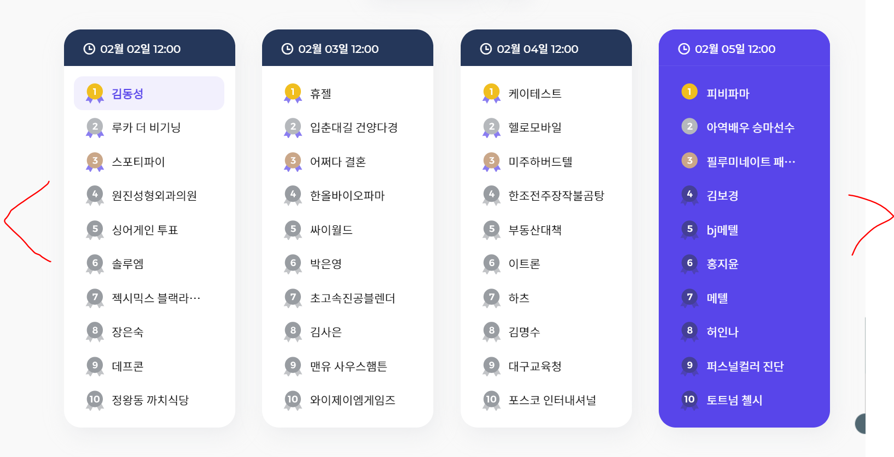
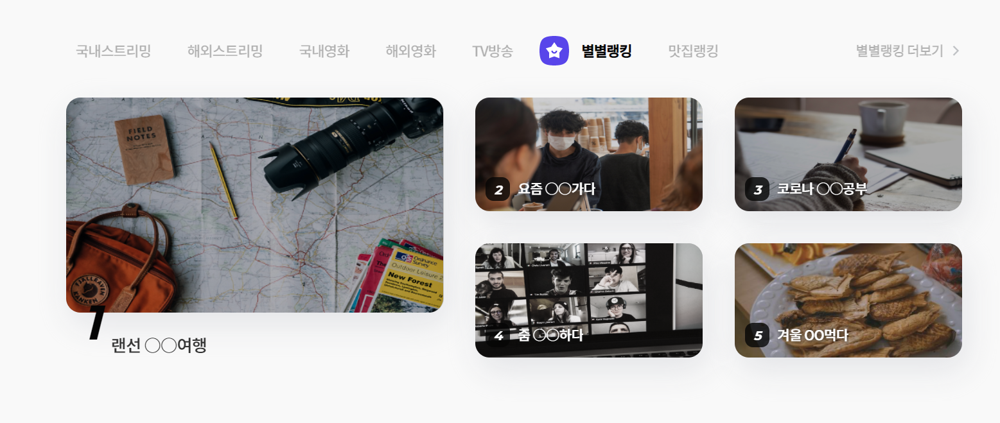
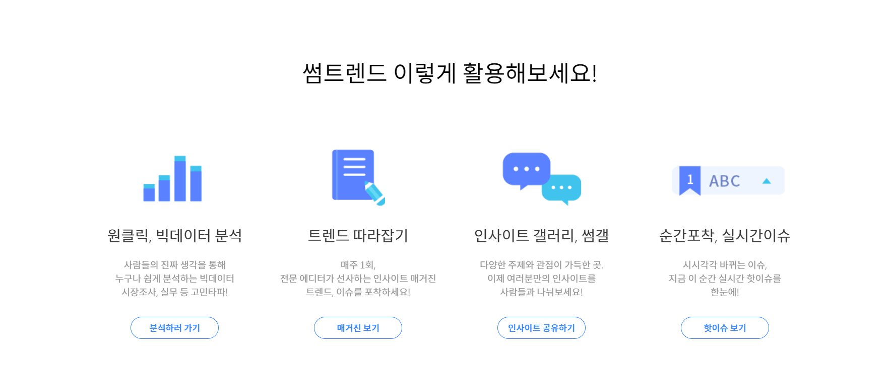
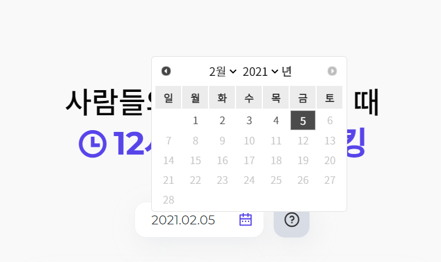
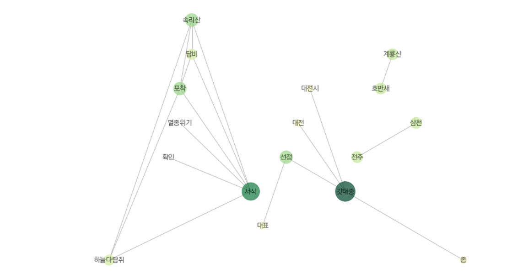

* #### 의견나눔게시판

  * 글쓰기 버튼 스크롤에 따라서 따라다니게!
  * https://some.co.kr/some-gallery/home

* #### 메인 페이지

  * https://some.co.kr/
  * 의견 나눔 해시태그 검색창 (궁금한 주제 키워드를 입력하세요.)
  * 아래에 핫한 태그 5개정도 보여주기

  

  * 스크롤 내리면 카테고리별 오늘의 실시간 랭킹 보여주기 < > : 이걸로 옆으로 넘길 수 있게

  
  * 핫한 의견 랭킹 보여주기 or 의견게시물 해시태그 워드클라우드

  

  * 마지막 부분에 추가?

  

* #### 이슈 페이지

  * 배너 

    

  * 날짜 선택할 수 있고, 메인페이지와 비슷하게 카테고리별로 검색어 순위 보여주기

  * 

  * 이슈 상세 페이지

    * 이슈와 관련된 뉴스기사링크 

    * 연관어 네트워크 그래프 제공

    * https://some.co.kr/trend/1

      

    이런 느낌으로 이슈 바가 옆으로 가고 오른쪽에 관련 정보가 나오는건 어떨까??

    지금 이슈 단어로 연관어분석해서 아래와 같이 연관된 단어 네트워크 형식으로 보여주는거 할 수 있으면 하는게 좋을 것 같아서!! 

    

    

* #### 마이페이지

  * 회원정보 수정
  * 내가 스크랩한 의견 목록
  * 내가 가입한 클럽

  

  * 좌측 바에 메뉴탭으로 정리해두면 좋을 것 같아!
  
  -> 그러면 페이지가 너무 많아지나? ㅠㅠ
  
  * 메인페이지 -> 나의 활동 통계 (내가 쓴 글 감정분석, 최근에 본 게시물, 자주 보는 카테고리 그래프)
  
  * 내 보관함 -> 내가 스크랩한 의견목록 / 내가 작성한 게시글
    * 클럽 관리 -> 내가 가입한 클럽
    * 회원정보 -> 회원정보 수정